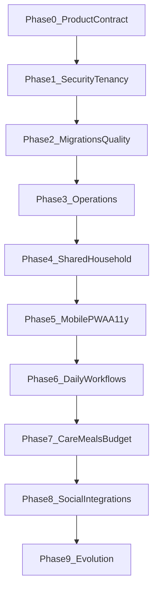
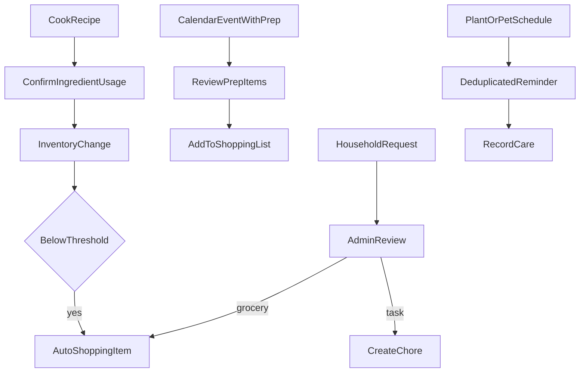
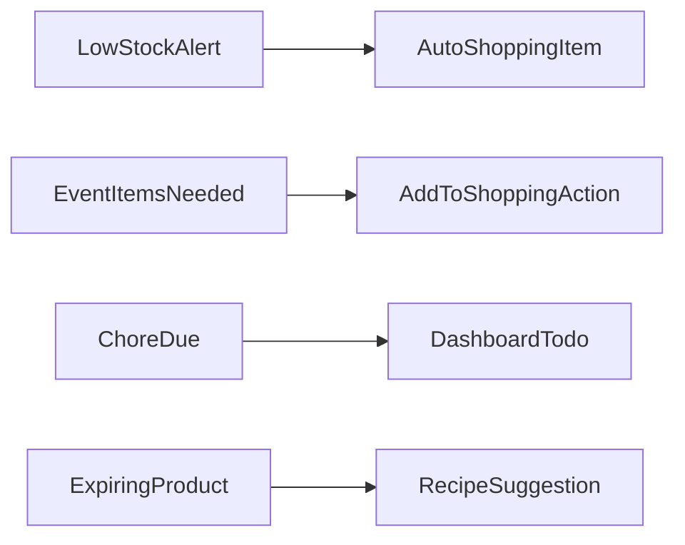

# HomeBase Roadmap

This document is the source of truth for **what HomeBase promises**, **what exists today**, **what must change**, and **the order we should build it**. It is based on an audit of the README feature list, current routes/modules/schema, scheduler jobs, deployment tooling, and cross-cutting infrastructure (auth, tenancy, PWA, tests).

**Audience:** maintainers, contributors, and coding agents working on this repo.

**Related docs:** [README](../README.md) · [AGENTS.md](../AGENTS.md) · [Release & deployment](release.md) · [NAS deployment](nas-deploy.md)

---

## Product direction

### Vision

HomeBase is the private, dependable household operating system for people who want to coordinate a home without handing its data, routines, and device access to a cloud service. It should make the next useful action obvious—whether that is buying milk, completing a chore, watering a plant, preparing for guests, or responding to an important household request.

The product is successful when a household can rely on it every day from a phone, understand what changed while they were away, and recover its data independently if the hosting device fails.

### Target households

| Household profile | Primary need | First workflows to optimize |
|-------------------|--------------|-----------------------------|
| One or two adults | Shared visibility without ceremony | Shopping, chores, calendar, deliveries |
| Families and shared homes | Clear ownership and predictable reminders | Roles, assignments, routines, requests |
| Care-focused households | Time-sensitive care history | Plants, pets, medication/care reminders, calendar |
| Privacy-conscious self-hosters | Local control and recoverability | Docker setup, backups, exports, no required cloud account |
| Smart-home enthusiasts | Useful context without unsafe automation | Read-only sensors first, explicit device controls second |

### Product principles

1. **Private by default.** Local deployment and household-scoped data are product requirements, not optional implementation details.
2. **Reliable beats clever.** An actionable reminder delivered once is more valuable than a sophisticated integration that duplicates alerts or silently fails.
3. **The household is the boundary.** Permissions, module settings, uploads, notifications, and integrations must all respect membership and role.
4. **Mobile-first, not mobile-only.** A phone must support daily capture and completion; desktop remains useful for planning, administration, and review.
5. **Progressive complexity.** A new household can start with shopping and chores, then enable deeper modules only when they are useful.
6. **Automation must be explainable.** Every generated shopping item, notification, recommendation, or device action needs a visible source and a reversible path.
7. **Self-hosting must be recoverable.** Upgrade, backup, restore, health, and diagnostic paths are core user experience.

### Non-goals for the v1 horizon

- Becoming a general-purpose family social network or a hosted SaaS service.
- Requiring a third-party account for core household workflows.
- Promising full offline conflict-free editing before there is an explicit sync and conflict model.
- Direct cloud carrier, camera, or smart-home integrations without an adapter boundary, credential policy, and privacy review.
- Supporting arbitrary third-party plugins before the core module, tenancy, and job contracts are stable.

### Roadmap vocabulary and tracking

| Label | Meaning | Commitment |
|-------|---------|------------|
| **Committed** | Required work in an approved phase | Build before the corresponding exit gate |
| **Discovery** | Validate need, design, privacy, and implementation cost | Not a promise to build |
| **Deferred** | Intentionally outside the current horizon | Reconsider only when prerequisites change |
| **Not started** | Defined but no implementation begun | Track in the issue/milestone system |
| **In progress** | Active implementation or review | Link changes and tests from the tracker |
| **Validated** | Acceptance criteria demonstrated in development/staging | Ready for release packaging |
| **Shipped** | Included in a tagged, deployed release | Keep audit status and release notes current |

Every feature item added to this document must identify its phase, status, user outcome, owner or tracker reference, acceptance criteria, and any privacy/security dependency. “Partial” is only useful during the audit; work planned from it must become a specific, testable outcome.

---

## Executive summary

HomeBase has a **broad, working skeleton** for every README feature: routes exist, the Prisma schema is comprehensive, module toggles work at the page layer, and most create/list flows function. It is **not yet production-ready for multi-user households** until security, migrations, tests, and operational hardening are complete.

| Layer | Maturity | Summary |
|-------|----------|---------|
| Schema & module registry | Good | Models and `ModuleId` enum align with `MODULE_REGISTRY` |
| Page-level UX | Partial | CRUD mostly create/list; little edit/delete; few cross-module workflows |
| Server actions | Risky | Many mutations lack household ownership checks |
| Roles & multi-user | Early | ADMIN/MEMBER/GUEST in schema; almost no server enforcement or invite flow |
| Background jobs | Partial | Scheduler runs; uneven dedup, module guards, and push delivery |
| PWA / mobile | Partial | Manifest + push opt-in; no offline cache, no mobile nav |
| Ops / CI / tests | Absent | No migrations history, no CI, no automated tests |

**Guiding principle:** finish **foundation phases (0–3)** before deepening feature modules. Do not treat README bullets as “done” until the acceptance criteria in each phase are met.

---

## Release train and decision gates

Dates are deliberately omitted: self-hosted reliability and authorization gates matter more than a calendar deadline. Create a release only when the preceding exit gate has evidence attached (tests, a deployment log, or a restore/smoke-test record).

| Release | Phases | Outcome | Must be true before release |
|---------|--------|---------|-----------------------------|
| `v0.2.0-foundation` | 0–2 | A safe engineering baseline | Authorization regression suite passes; migrations work from a clean clone; CI is green |
| `v0.3.0-operations` | 3 | A maintainable self-hosted instance | Health check, structured logs, and a successful backup/restore drill exist |
| `v0.4.0-households` | 4 | Real shared households | Invitation, role policy, module administration, and guest read-only tests pass |
| `v0.5.0-mobile` | 5 | Reliable daily phone usage | Core flows usable at 375px; install and offline fallback verified; critical accessibility checks pass |
| `v0.6.0-daily-workflows` | 6 | Complete daily planning loop | Inventory, shopping, tasks, and calendar work together for a full representative week |
| `v0.7.0-life-management` | 7 | Care, meals, routines, and money are trustworthy | Care reminders dedupe; meal inventory linkage and budget periods are verified |
| `v0.8.0-connected-home` | 8 | Controlled communication and integrations | Request automations, delivery lifecycle, and household-scoped device actions work with visible errors |
| `v1.0.0-homebase` | 9 plus release audit | A stable supported product | Performance baseline, audit/export paths, upgrade guide, and full release checklist are complete |

### Release evidence checklist

Before tagging a release, record:

1. Schema migration tested against a copy of production-like data and the rollback/recovery procedure documented.
2. `npm run lint`, `npm run build`, Prisma validation, unit/integration tests, and browser smoke tests passing in CI.
3. An authorization test proving a user cannot read or mutate another household’s data via IDs, nested resources, uploads, or module actions.
4. A mobile smoke test covering login, dashboard, create/complete a daily item, and sign-out.
5. Worker jobs observed for one schedule interval without duplicate notifications or unhandled errors.
6. A backup created and restored into a clean environment, with database and uploads both verified.
7. Release notes listing behavior changes, migrations, environment changes, known limitations, and upgrade steps.

### Decision log

Record irreversible or cross-cutting decisions here (or in an ADR linked from here) before implementation.

| Decision | Default direction | Revisit when |
|----------|-------------------|--------------|
| Background jobs | Keep `node-cron` with a single worker until a multi-worker requirement exists | Multiple workers or scheduled-job reliability cannot be demonstrated |
| Offline support | Readable app shell and explicit fallback before mutation sync | A conflict policy and durable client queue are designed and tested |
| Smart-home integrations | Adapter boundary; Home Assistant/read-only sensors before direct device control | Credential storage, consent, and support burden are defined |
| Multi-household users | Invite and role flow first; household switching later | A real user belongs to multiple active households |
| External providers | Optional and opt-in only | Credential lifecycle, error UX, rate limits, and privacy implications are documented |

---

## Phase dependency map

---

## Current implementation audit (README vs reality)

Legend: **Done** · **Partial** · **Missing** · **Risk** (security/ops gap)

### Inventory

| README claim | Status | Current implementation | Gaps & changes needed |
|--------------|--------|------------------------|------------------------|
| Product tracking | **Partial** | `src/app/(app)/inventory/`, `src/modules/inventory/actions.ts` | Add edit/delete product, stock decrement, batch views |
| Barcode scanning | **Partial** | `BarcodeScanner.tsx`, `InventoryClient.tsx` | Wire `findProductByBarcode()` — scan only prefills form today |
| Locations | **Done** | `Location` model, `createLocation`, `getLocations` | — |
| Low-stock alerts | **Done** | `checkLowStock` in `src/core/scheduler/index.ts`, dashboard widget | Harden tenancy on `addStock`; test auto-add to shopping |

**Implementation plan (Phase 6):**

1. **Scan-to-act flow:** On scan, call `findProductByBarcode`; if found, open stock adjust UI; if not, prefill new product form.
2. **Stock lifecycle:** `adjustStock`, `decrementStock`, `deleteStockItem` with household guards.
3. **Product CRUD:** `updateProduct`, `deleteProduct` (cascade rules for barcodes/stock).
4. **Expiry UX:** Surface expiring items on inventory page; link to recipe suggestions when `productId` is set on ingredients.
5. **Tests:** Low-stock threshold, auto shopping item creation, scan lookup.

**Files:** `src/modules/inventory/actions.ts`, `src/app/(app)/inventory/InventoryClient.tsx`, `src/core/scheduler/index.ts`

---

### Shopping

| README claim | Status | Current implementation | Gaps & changes needed |
|--------------|--------|------------------------|------------------------|
| Smart lists | **Partial** | `shopping/page.tsx` uses `lists[0]` only | **T-035:** catalog + need view; multi-list deferred |
| Auto-population | **Partial** | Scheduler adds rows globally | **T-035:** per-product `autoAddWhenLowStock` (default off) |
| Store filtering | **Done** | `?store=` query, `getFilteredItems` | — |
| Tags | **Partial** | Tags stored on `ShoppingItem` | Tag filter UI; slot remembers last tags |

**T-035 design (accepted 2026-09-02, ADR-010):** `Product` = persistent catalog;
one primary-list slot per product; needed items only on main view; bought clears
need + purchase event + inventory bump when stock-tracked; desktop catalog panel +
mobile typeahead; unique product name per household.

**Implementation plan (T-035 — before Phase 6 multi-list work):**

1. **Schema:** `PurchaseEvent` (or equivalent), `Product.lastPurchasedAt`,
   `Product.autoAddWhenLowStock` (default false), unique `(householdId, name)`;
   unique `(shoppingListId, productId)` on slots.
2. **Domain:** `markNeeded`, `markBought`, upsert slot; migrate orphan free-text rows.
3. **UI:** Catalog browse/search + needed list (desktop); quick-add typeahead (mobile).
4. **Scheduler:** Auto-add only when product opt-in is on.
5. **MCP:** Update contract notes for `list`, `add_item`, implement `complete_item`.

**Future (after T-035 data exists):**

- **Replenishment predictions** — suggest re-need from purchase history cadence.
- **Receipt capture** — extend existing opportunity (Phase 7+): OCR line items →
  match/create `Product`, append purchase events, optional BudgetTracker handoff.
  See opportunity backlog row “Receipt capture and expense import”.

**Files:** `src/modules/shopping/`, `src/domain/shopping/`, `src/app/(app)/shopping/`,
`prisma/schema.prisma`, `src/core/scheduler/index.ts`

---

### Tasks

| README claim | Status | Current implementation | Gaps & changes needed |
|--------------|--------|------------------------|------------------------|
| Recurring chores | **Done** | `Chore.intervalDays`, `nextDue`, `completeChore` | Edit/delete chore; overdue UI |
| Timers | **Done** | `TasksClient.tsx` timer → `durationMin` on complete | — |
| Projects + checklists | **Partial** | `Project`, `ProjectStep`, `toggleProjectStep` | Edit/delete project/steps; fix `toggleProjectStep` household guard |
| Photos | **Done** | `addProjectUpdate` + `saveUpload` | — |

**Implementation plan (Phase 6):**

1. **Chore lifecycle:** `updateChore`, `deleteChore`, completion history view, avg duration display (`getAverageChoreDuration`).
2. **Project lifecycle:** `updateProject`, `deleteProject`, reorder steps.
3. **Dashboard:** Quick-complete links from dashboard todos.
4. **Scheduler:** Dedup on `checkChoreDeadlines` (currently spams).

**Files:** `src/modules/tasks/actions.ts`, `src/app/(app)/tasks/`, `src/core/scheduler/index.ts`

---

### Plants & Pets

| README claim | Status | Current implementation | Gaps & changes needed |
|--------------|--------|------------------------|------------------------|
| Watering schedules | **Done** | `waterPlant`, `updatePlantWateringSchedule` | Dedup watering notifications |
| Appointments (pets) | **Partial** | `addPetAppointment`, pets page | Reminders; edit/delete |
| Feeding routines | **Partial** | `FeedingRoutine` add-only | Completion tracking, reminders |

**Implementation plan (Phase 7):**

1. **Plants:** Edit/delete plant; photo log gallery; module guard on `checkPlantWatering`.
2. **Pets:** `updatePet`, feeding log + “fed today”; scheduler `checkPetAppointments`, `checkFeedingRoutines`.
3. **Badges:** Award `Green Thumb` when criteria met (seed defines badge, never awarded).
4. **Guards:** `waterPlant`, `addPetAppointment`, `addFeedingRoutine` must verify household.

**Files:** `src/modules/homecare/actions.ts`, `src/app/(app)/plants/`, `src/app/(app)/pets/`, `src/core/scheduler/index.ts`

---

### Calendar

| README claim | Status | Current implementation | Gaps & changes needed |
|--------------|--------|------------------------|------------------------|
| Events + reminders | **Done** | `createCalendarEvent`, `checkCalendarReminders` (deduped) | Calendar grid view; edit/delete |
| Guests | **Done** | `EventGuest` on create form | — |
| Prep lists | **Done** | `itemsNeeded` on events | — |
| “Last time” tracking | **Done** | `EventLog`, “Last Time” tab | — |

**Implementation plan (Phase 6):**

1. **Views:** Week/month list or simple calendar component.
2. **CRUD:** `updateCalendarEvent`, `deleteCalendarEvent`.
3. **Prep workflow:** “Add items to shopping” action from event prep list.

**Files:** `src/modules/scheduling/actions.ts`, `src/app/(app)/calendar/page.tsx`

---

### Routines

| README claim | Status | Current implementation | Gaps & changes needed |
|--------------|--------|------------------------|------------------------|
| Shared routines | **Partial** | Creator auto-added as `RoutineMember` | Invite/add member UI |
| Dependencies | **Partial** | Enforced in `completeRoutineTask` | Per-recurrence dependency checks |
| Templates | **Partial** | Seed template + `createRoutineFromTemplate` | Create-template UI/action |
| Gamification | **Partial** | Points/streak; `Week Streak` badge only | Award all seeded badges; leaderboard optional |

**Implementation plan (Phase 7):**

1. **Members:** `addRoutineMember`, `removeRoutineMember` (household members only).
2. **Templates:** `createRoutineTemplate`, template editor.
3. **Recurrence engine:** Daily/weekly reset of completable tasks; honor `reminderMinutes`.
4. **Scheduler:** `checkRoutineReminders` with module guard + dedup.
5. **Attachments:** Use `attachmentUrl` on `RoutineTask` via upload service.

**Files:** `src/modules/scheduling/actions.ts`, `src/app/(app)/routines/page.tsx`, `src/core/scheduler/index.ts`

---

### Recipes

| README claim | Status | Current implementation | Gaps & changes needed |
|--------------|--------|------------------------|------------------------|
| Instructions | **Done** | `createRecipe`, `RecipesClient.tsx` | Edit/delete recipe |
| Multiple timers | **Done** | `RecipeTimer`, client countdown | — |
| Inventory-linked ingredients | **Partial** | `RecipeIngredient.productId` in schema | `createRecipe` never sets `productId` |
| Leftovers | **Done** | `Leftover`, `addLeftover` | — |

**Implementation plan (Phase 7):**

1. **Ingredient picker:** Product autocomplete from inventory when adding ingredients.
2. **Cook flow:** Optional “cook recipe” → decrement stock (configurable per household).
3. **Availability:** Show in-stock / low-stock per ingredient on recipe detail.
4. **Expiry hints:** `checkExpiringProducts` recipe suggestions work once `productId` is populated.

**Files:** `src/modules/recipes/actions.ts`, `src/app/(app)/recipes/RecipesClient.tsx`

---

### Budget

| README claim | Status | Current implementation | Gaps & changes needed |
|--------------|--------|------------------------|------------------------|
| Category budgets | **Done** | `Budget`, `createBudget` | Actions live in `recipes/actions.ts` — split module |
| Expense tracking | **Partial** | `addExpense`, `getBudgetRemaining` | `period` field ignored — sums all expenses |

**Implementation plan (Phase 7):**

1. **Module split:** `src/modules/budget/actions.ts` + update imports.
2. **Period logic:** Filter expenses by weekly/monthly/yearly window in `src/lib/budget.ts`.
3. **Reporting:** Period progress bars, category breakdown, optional expense edit/delete.

**Files:** `src/modules/budget/actions.ts` (new), `src/lib/budget.ts`, `src/app/(app)/budget/page.tsx`

---

### Delivery

| README claim | Status | Current implementation | Gaps & changes needed |
|--------------|--------|------------------------|------------------------|
| Package tracking | **Done** | `DeliveryPackage`, delivery page | Edit/delete; status history |
| Arrival alerts | **Partial** | `checkDeliveryAlerts` (5 min before `earliestTime`) | No dedup; manual time entry only |

**Implementation plan (Phase 8):**

1. **Dedup** delivery notifications (same pattern as calendar).
2. **Status workflow:** Clear transitions; optional “mark delivered”.
3. **Guards:** `updateDeliveryStatus` needs `requireHousehold` + ownership.
4. **Deferred:** Carrier API integration (UPS/FedEx) — requires provider selection and credentials model.

**Files:** `src/modules/social/actions.ts`, `src/app/(app)/delivery/page.tsx`, `src/core/scheduler/index.ts`

---

### Messages

| README claim | Status | Current implementation | Gaps & changes needed |
|--------------|--------|------------------------|------------------------|
| Group chat | **Partial** | Last 50 messages, no polling/realtime | Polling or SSE; pagination |
| Grocery/task requests | **Partial** | Create + admin approve UI | Approval doesn’t create shopping item or chore |
| Visitor preferences | **Done** | Settings UI + `VisitorPreference` | Replace raw JSON with structured form |

**Implementation plan (Phase 8):**

1. **Admin enforcement:** `updateRequestStatus` → `requireAdmin()` server-side.
2. **Workflow:** On approve GROCERY → `addShoppingItem`; on approve TASK → `createChore`.
3. **COMPLETED status:** UI for request lifecycle.
4. **Chat:** Lightweight polling (30s) or future realtime channel.

**Files:** `src/modules/social/actions.ts`, `src/app/(app)/messages/page.tsx`, `src/app/(app)/settings/page.tsx`

---

### Smart Home

| README claim | Status | Current implementation | Gaps & changes needed |
|--------------|--------|------------------------|------------------------|
| Sensor readings | **Partial** | Manual log form | Automated ingestion contract |
| Window recommendations | **Done** | `getWindowRecommendation` in `src/lib/smarthome.ts` | — |
| Philips Hue | **Partial** | `controlHueLight` (env + device config) | Brightness in UI; device ownership guard |
| Cameras | **Partial** | Static `` from device config | Secure stream proxy; no credential leak |

**Implementation plan (Phase 8):**

1. **Guards:** All device/sensor mutations verify `householdId`.
2. **Hue:** Brightness slider; discover/link flow (optional).
3. **Sensors:** Optional webhook or periodic poll adapter; retention policy for readings.
4. **Cameras:** Server-side stream URL resolution only; never expose bridge passwords to client.

**Files:** `src/modules/smarthome/actions.ts`, `src/lib/smarthome.ts`, `src/app/(app)/smart-home/SmartHomeClient.tsx`

---

### Module system

| README claim | Status | Current implementation | Gaps & changes needed |
|--------------|--------|------------------------|------------------------|
| Toggle per household | **Partial** | Registry, settings, page `requireModule`, sidebar | Actions not module-guarded; toggles not ADMIN-only; dashboard ignores modules |

**Implementation plan (Phases 1 & 4):**

1. `requireModule(householdId, moduleId)` at top of every feature action file.
2. `requireAdmin()` on module toggles in settings.
3. Dashboard sections respect `getEnabledModules`.
4. Optional: SETTINGS pseudo-module for admin-only settings routes.

**Files:** `src/core/modules/guard.ts`, `src/core/modules/settings.ts`, all `src/modules/*/actions.ts`, `src/app/(app)/dashboard/page.tsx`

---

### PWA

| README claim | Status | Current implementation | Gaps & changes needed |
|--------------|--------|------------------------|------------------------|
| Installable app | **Partial** | `manifest.json`, layout metadata | Multi-size icons; install prompt UX |
| Push notifications | **Partial** | SW + VAPID + settings opt-in | Scheduler omits `userId` → no background push; SW not registered on load |
| Offline | **Missing** | `sw.js` push-only | No fetch/cache strategy |

**Implementation plan (Phases 3 & 5):**

1. **Push fan-out:** Notify all household `PushSubscription` rows (or per-user prefs).
2. **SW bootstrap:** Register on app load, separate from permission prompt.
3. **Offline shell:** Cache app shell + offline fallback page; document limitations.
4. **Icons:** `public/icons/` PNG set for manifest.

**Files:** `public/sw.js`, `public/manifest.json`, `src/core/notifications/service.ts`, `src/app/layout.tsx`

---

## Product workflows and definition of done

The feature audit describes implementation gaps. This section defines the user-facing behavior that closes them. A module is not complete merely because its create form and database model exist.

| Area | User outcome | Done when | Important edge cases |
|------|--------------|-----------|----------------------|
| Inventory | I know what I own, where it is, and what needs replacing | Scan, create, adjust, edit, archive/delete, and review expiring stock from a phone; every change identifies product and location | Duplicate barcode, negative/zero quantities, expired batches, deleted location, simultaneous stock adjustment |
| Shopping | Our household has one trustworthy purchase plan | Multiple named lists, item ownership/source, tag/store filtering, quick check-off, and explicit auto-added-item behavior | Disabled inventory module, deleted product/store/list, duplicates, offline read-only view |
| Tasks and projects | We know what is due, who completed it, and what remains | Recurring task lifecycle, history, assignment-ready data model, project step ordering, and one-click dashboard completion | Overdue recurrence, timezone boundaries, deleted assignee, concurrent completion, notification deduplication |
| Calendar | We can prepare for events instead of just recording them | Mobile-friendly week/month agenda, event CRUD, reminder delivery once, guests/prep list, and prep-to-shopping hand-off | All-day/timezone semantics, past events, duplicate prep items, event deletion after generated items |
| Plants and pets | Care occurs on schedule with a useful history | Care logs, photos where useful, appointment/feeding/reminder workflows, and overdue/complete states | Missed care, rescheduled appointment, pet/plant removal with history retention, alert deduplication |
| Routines | Repeated shared work is fair and understandable | Membership, recurrence cycle, dependency status, completion history, points/streak rules, and reminders | Dependency cycles, late completions, member leaves household, recurrence changes mid-cycle |
| Recipes and meals | We can decide what to cook from what is available | Ingredient-to-product links, availability state, cooking stock changes with confirmation, leftovers, and timer accessibility | Partial quantities, unit mismatch, optional ingredients, stock changed since recipe opened |
| Budget | We can see spending against the correct period | Period-aware totals, category views, expense lifecycle, and an obvious calculation boundary | Week/month/year boundary and timezone, uncategorized expense, deleted budget, rounding/currency policy |
| Messages and requests | Household communication leads to visible action | Readable recent history, pagination/polling behavior, request states, and approval automation with an audit trail | Admin role changes, action target deleted, duplicate approval, sensitive content retention |
| Deliveries | Expected packages do not get lost | Manual lifecycle, one-time arrival reminder, delivery confirmation, status history, and clear manual-provider boundary | Unknown carrier, changed arrival window, repeated scheduler run, already-delivered package |
| Smart home | Device information helps us act without leaking control | Household-scoped devices, explainable recommendations, error state, and server-only credentials | Unreachable bridge, malformed reading, removed device, camera/stream authorization |
| Settings and modules | The app contains only the features the household chooses | Admin-only module control, disabled routes/actions blocked, module-aware dashboard, and preferences that explain their effect | Module disabled with existing data, guest attempting settings change, partial migration of a module |

### Cross-module journeys

These journeys are the primary end-to-end test scenarios for product releases. They should remain understandable to users: automation must show its source, target, and reversal action.

#### Journey acceptance criteria

1. **Replenish stock:** Adjusting a product below its threshold creates at most one open auto-added shopping item per list/product. Restocking, dismissing, or manually deleting the item has an understandable result and is recorded in activity history once that exists.
2. **Prepare for an event:** An event’s prep items can be reviewed and added to a chosen shopping list without silently duplicating existing open items. The generated item points back to the event until the event is removed.
3. **Cook from inventory:** A recipe presents current availability and a confirmation preview before reducing stock. Users can decline the adjustment, alter quantities, or record leftovers without changing the recipe itself.
4. **Complete care:** A reminder links to the specific plant, pet, appointment, or feeding routine; completion records who and when; repeated worker executions do not send duplicate alerts.
5. **Approve a request:** Only an admin can approve once. The resulting shopping item or chore has a visible request source, and a failed automation leaves the request in a recoverable state rather than falsely claiming completion.
6. **Recover a household:** A documented backup restores data and uploads into a clean instance. The restored admin can sign in, view a dashboard, and open a representative upload.

### Shared UX and data rules

- Use a consistent lifecycle vocabulary: active/open, completed/checked, archived/dismissed, deleted. Prefer archive/history for household records where a future audit matters.
- Every automatic record includes a human-readable source (`low stock`, `event prep`, `approved request`, and so on) plus a link where safe.
- Confirm destructive actions; offer undo where practical; never cascade-delete cross-module records without explaining the effect.
- Show empty states with a single next action, loading/error states for all network-dependent views, and retry guidance for integrations.
- Store timestamps in UTC and display them in the household/user timezone once timezone preferences are introduced. Do not infer all-day event semantics from a timestamp alone.
- Set pagination and retention rules before a table can grow without bound (messages, notifications, sensor readings, logs, uploaded photos).

---

## Infrastructure audit (must fix regardless of feature)

### P0 — Security & tenancy

| Issue | Paths | Remediation (Phase 1) |
|-------|-------|------------------------|
| Cross-household IDOR on mutations | `src/modules/*/actions.ts`, `src/core/notifications/service.ts` | `assertHouseholdResource()` helper; `updateMany`/`deleteMany` with `{ id, householdId }` |
| Public uploads without auth | `src/middleware.ts`, `src/app/api/uploads/[...path]/route.ts` | Auth-gated or signed URLs; `path.resolve` + prefix check |
| Admin checks UI-only | `settings/page.tsx`, `social/actions.ts` | Call `requireAdmin()` in server actions |
| `requireAdmin()` never used | `src/core/auth/session.ts` | Wire to settings, requests, membership admin |
| GUEST role unenforced | Schema only | Define read-only policy per module |
| Module actions callable when disabled | All `src/modules/*/actions.ts` | `requireModule()` in actions |

### P0 — Data & quality

| Issue | Paths | Remediation (Phase 2) |
|-------|-------|------------------------|
| No migration history | `prisma/` (no `migrations/`) | Initial `prisma migrate`; deploy uses `migrate deploy` |
| `db push` in production deploy | `scripts/deploy.sh` | Replace with `prisma migrate deploy` |
| No tests or CI | Repo root | Vitest + Playwright + `.github/workflows/ci.yml` |
| No indexes on `householdId` | `prisma/schema.prisma` | Add indexes on hot tables |

### P1 — Operations

| Issue | Paths | Remediation (Phase 3) |
|-------|-------|------------------------|
| No health endpoint | — | `src/app/api/health/route.ts` |
| Console-only logging | `worker/index.ts`, scheduler | Structured logging wrapper |
| Manual backup docs only | `docs/nas-deploy.md` | `scripts/backup.sh`, `scripts/restore.sh` |
| Redis/BullMQ unused | `docker-compose.yml`, `package.json` | Adopt for job locks **or** remove from compose |
| Scheduler spam / no module guards | `src/core/scheduler/index.ts` | Dedup + `ModuleSetting` checks on all jobs |
| No security headers | `next.config.ts` | CSP, HSTS, X-Frame-Options |

### P1 — Multi-user & auth

| Issue | Paths | Remediation (Phase 4) |
|-------|-------|------------------------|
| Single household in JWT (`memberships[0]`) | `src/core/auth/config.ts` | Household switcher; refresh membership in JWT callback |
| No invite/join flow | — | `HouseholdInvite` model + join page |
| Open registration | `register/page.tsx` | Optional `ALLOW_REGISTRATION=false` |
| Auth errors not shown | `login/page.tsx`, `register/page.tsx` | Read `?error=` from searchParams |

---

## Phased implementation plan

Each phase has an **exit gate** — do not start the next phase until the gate is met.

---

### Phase 0 — Product contract & release discipline

**Status:** **Validated** (exit gate met)

**Goal:** Align README, roadmap, and reality; define how we ship.

**Work:**

1. Keep this file (`docs/roadmap.md`) updated when scope changes.
2. Define milestone naming (e.g. `v0.2.0-foundation`, `v0.3.0-households`) — see [release.md](release.md).
3. Document release checklist: migrate → build → test → deploy → smoke on NAS — see [release.md](release.md).
4. Document architecture ownership — see [release.md](release.md) and [AGENTS.md](../AGENTS.md).
5. Add “supported deployment” matrix: Docker Compose on NAS, dev local + worker — see [release.md](release.md).

**Exit gate:** Roadmap published; README links here; AGENTS.md references phase gates for agents.

---

### Phase 1 — Secure household tenancy & authorization

**Goal:** Close IDOR and authorization bypass holes.

**Work:**

1. Create `src/core/tenancy/assertHouseholdResource.ts` (or similar):
   - `assertProduct(householdId, productId)`
   - Generic patterns for nested resources (shopping list → items, project → steps)
2. Audit and fix **every** mutation in:
   - `src/modules/inventory/actions.ts`
   - `src/modules/shopping/actions.ts`
   - `src/modules/tasks/actions.ts`
   - `src/modules/scheduling/actions.ts`
   - `src/modules/homecare/actions.ts`
   - `src/modules/recipes/actions.ts`
   - `src/modules/social/actions.ts`
   - `src/modules/smarthome/actions.ts`
   - `src/core/notifications/service.ts` (`markNotificationRead`)
3. Enforce `requireAdmin()` on:
   - Module toggles (`settings/page.tsx` inline action)
   - `updateRequestStatus`
   - Future membership management
4. Add `requireModule()` wrapper used by all feature actions.
5. Secure uploads:
   - Require session; verify user’s household owns the upload path
   - Normalize paths in upload route; reject `..`
   - Max size + MIME whitelist in `src/core/uploads/service.ts`
6. Add Zod schemas per action (start with high-risk: social, shopping, smarthome).

**Exit gate:** Tenancy test suite — cross-household mutation attempts fail; upload URLs require auth.

**Estimated effort:** 1–2 weeks

---

### Phase 2 — Data lifecycle & engineering quality gates

**Goal:** Reproducible schema evolution and regression prevention.

**Work:**

1. `npx prisma migrate dev --name init` from current schema.
2. Update `scripts/deploy.sh`: `prisma migrate deploy` instead of `db push`.
3. Add indexes, e.g.:
   - `@@index([householdId])` on Product, StockItem, Chore, CalendarEvent, Notification, etc.
   - Scheduler query fields: `nextWatering`, `deadline`, `startAt`, `earliestTime`
4. Fix `SensorReading.deviceId` → optional FK to `Device` if we keep device linkage.
5. Add `.github/workflows/ci.yml`:
   - `npm ci --legacy-peer-deps`
   - `npm run lint`
   - `npm run build`
   - `prisma validate`
   - `npm test` (once added)
6. Add Vitest:
   - Unit tests for `getBudgetRemaining` (after period fix), `getWindowRecommendation`, tenancy helpers
   - Integration tests with test DB for household scoping
7. Add Playwright smoke: register/login → inventory create → logout.

**Exit gate:** Clean clone → migrate → build → CI green.

**Estimated effort:** 1–2 weeks

---

### Phase 3 — Reliable self-hosting & notifications

**Goal:** Operable on NAS; trustworthy background alerts.

**Work:**

1. `GET /api/health` — DB ping + optional worker heartbeat flag.
2. Structured logging in worker/scheduler (JSON lines, job name, householdId, duration).
3. `scripts/backup.sh` + `scripts/restore.sh` for `postgres_data` + `uploads_data`; document in `nas-deploy.md`.
4. Scheduler hardening (`src/core/scheduler/index.ts`):
   - Module guard on every job
   - Dedup for plant watering, chores, delivery (match calendar/low-stock patterns)
   - Batch queries instead of per-household N+1 where practical
5. Push delivery:
   - When `userId` omitted, fan out to all push subscriptions for household members (respect opt-out pref later)
   - Or: document that only user-targeted notifications push until prefs exist
6. **Redis/BullMQ decision** (document in ADR or roadmap appendix):
   - **Option A:** Remove redis service until needed
   - **Option B:** Move cron to BullMQ repeatable jobs with distributed lock (multi-worker safe)
7. Docker: `.dockerignore`, align README Prisma commands with deploy script, security headers in `next.config.ts`.

**Exit gate:** Backup restore drill succeeds; health endpoint returns 200; no duplicate plant/chore notifications in 24h test.

**Estimated effort:** 1 week

---

### Phase 4 — Shared household foundation & onboarding

**Goal:** Real multi-user households with enforced roles.

**Work:**

1. Schema: `HouseholdInvite` (token, email, role, expiresAt, householdId).
2. `src/modules/household/actions.ts`:
   - `createInvite`, `revokeInvite`, `acceptInvite`, `listMembers`, `updateMemberRole`, `removeMember`
3. UI: `src/app/(app)/settings/members/page.tsx`
4. JWT callback: refresh `role` and `householdId` from DB; support `activeHouseholdId` if multi-membership later.
5. `ALLOW_REGISTRATION` env flag in `.env.example`.
6. Auth UX: display login/register errors from URL.
7. Onboarding card on dashboard: enable modules, invite member, enable push, confirm worker running.
8. Dashboard: module-aware sections; unread count in sidebar (`getUnreadCount`).

**Role policy (define and enforce):**

| Role | Read | Write | Admin |
|------|------|-------|-------|
| ADMIN | All enabled modules | All enabled modules | Settings, members, request approval |
| MEMBER | All enabled modules | All enabled modules | — |
| GUEST | All enabled modules | Read-only (no mutations) | — |

**Exit gate:** Admin invites member; member sees scoped data; guest cannot mutate; module toggle requires admin.

**Estimated effort:** 2 weeks

---

### Phase 5 — Mobile, PWA & accessibility baseline

**Goal:** Usable on phones; installable; accessible core flows.

**Work:**

1. Responsive shell: drawer or bottom nav on `< md` (`AppShell.tsx`, `Sidebar.tsx`).
2. Register service worker on app load (not only push button).
3. PWA icons + install instructions in settings.
4. Offline: cache shell assets; offline fallback page with clear messaging.
5. Accessibility:
   - Skip link, `aria-label` on nav, chart text alternatives in `TodayTile.tsx`
   - Replace decorative Switch-in-button on settings with real controlled switch
   - Structured visitor preference form (no raw JSON)
   - `prefers-reduced-motion` in `globals.css`
6. axe or Playwright a11y checks on login + dashboard.

**Exit gate:** Usable on 375px viewport; Lighthouse PWA installable; critical a11y checks pass.

**Estimated effort:** 1–2 weeks

---

### Phase 6 — Everyday household workflows

**Goal:** Complete the four modules households use daily.

**Order within phase:** Inventory → Shopping → Tasks → Calendar (inventory feeds shopping; calendar prep feeds shopping).

**Inventory** — see audit section above.

**Shopping** — multi-list, tags, guards.

**Tasks** — full lifecycle, dashboard actions, scheduler dedup.

**Calendar** — grid view, CRUD, prep → shopping integration.

**Cross-module rules:**

**Exit gate:** A household can run a week of inventory, shopping, chores, and events without duplicate alerts or manual DB fixes.

**Estimated effort:** 3–4 weeks

---

### Phase 7 — Care, routines, meals & finances

**Goal:** Depth on lifestyle modules that depend on stable daily workflows.

**Order:** Plants/Pets → Routines → Recipes → Budget

**Dependencies:**

- Recipes ingredient linking **requires** inventory product picker (Phase 6 inventory).
- Budget period logic is independent but benefits from expense discipline from shopping/tasks.

**Exit gate:** Watering/feeding reminders deduped; routine recurrence resets; recipe shows stock availability; budget respects monthly period.

**Estimated effort:** 3–4 weeks

---

### Phase 8 — Communication, delivery & smart home

**Goal:** Close social/integration loops.

**Order:** Messages (requests workflow) → Delivery → Smart Home

**Messages first** — unlocks approved grocery/task automation into Phase 6 modules.

**Delivery** — manual tracking mature; carrier APIs explicitly deferred.

**Smart home** — last; highest env/hardware variance; needs solid auth from Phase 1.

**Exit gate:** Approve grocery request → item on shopping list; Hue/camera actions household-scoped; integration errors visible in UI.

**Estimated effort:** 3–4 weeks

---

### Phase 9 — Product polish & long-term evolution

**Goal:** Sustainable growth without architectural drift.

**Work:**

1. Pagination/search on messages, notifications, inventory, event logs.
2. Performance budgets; explain analyze on dashboard queries.
3. Audit log table for admin actions (module toggle, role change, invite).
4. Export household data (GDPR-style); documented deletion policy.
5. Optional telemetry hook for self-hosters (off by default).
6. Revisit: realtime chat, carrier tracking APIs, BullMQ job platform, plugin registry for scheduler.

**Exit gate:** Documented performance baseline; audit log for sensitive actions; export script exists.

**Estimated effort:** Ongoing

---

## Quality, trust, and operability roadmap

These tracks run alongside the numbered phases. They are release requirements, not optional polish.

### Security and privacy

| Increment | Phase | Required outcome |
|-----------|-------|------------------|
| Authorization baseline | 1 | Household-scoped reads/mutations, role enforcement, module checks, and protected uploads have automated regression coverage |
| Input and session hardening | 1–2 | Zod validation for mutations, safe errors, rate-limit strategy for credentials and sensitive actions, and documented session expiry/sign-out behavior |
| Data controls | 4–9 | Admin activity log, export, deletion/retention policy, file lifecycle controls, and documented handling of visitor and device data |
| Integration controls | 8 | Server-only credentials, opt-in consent, integration health/error state, credential rotation/removal, and no secret exposure in browser payloads |

### Accessibility and inclusive design

| Increment | Phase | Required outcome |
|-----------|-------|------------------|
| Foundation | 5 | Keyboard navigation, visible focus, semantic forms, skip navigation, labels, error summaries, and color-independent status |
| Mobile interaction | 5–6 | Touch targets, responsive dialogs, no hover-only controls, readable density at 200% zoom, and screen-reader labels for all quick actions |
| Complex workflows | 6–8 | Accessible timer updates, calendar alternatives, chart summaries, drag/reorder alternatives, and notification preference control |
| Continuous confidence | 5 onward | Automated axe checks on login/dashboard plus manual keyboard/screen-reader checks before each milestone |

### Performance and data lifecycle

1. Establish baseline page-load and interaction targets after Phase 5 for dashboard, inventory, shopping, and calendar on a modest phone/network.
2. Add indexes and query instrumentation before production-size household data is expected; record query plans for dashboard and worker hot paths.
3. Use pagination/search for unbounded entities; define default retention for sensor readings, notification history, message history, logs, and unreferenced uploads.
4. Treat N+1 database access, unbounded dashboard queries, and large client component payloads as release blockers once observed.
5. Add a household data export that is portable, versioned, and documented before claiming data ownership as a product capability.

### Self-hosting supportability

| Capability | Target phase | Evidence |
|------------|--------------|----------|
| Environment validation | 3 | Startup or health diagnostics identify missing mandatory variables without exposing values |
| Health and worker visibility | 3 | Health endpoint, worker heartbeat/last-successful-job status, and meaningful logs |
| Backup and restore | 3 | Versioned backup command, restore command, documented retention, and successful drill |
| Upgrade safety | 2–3 | Migration-aware deploy script, release notes, schema compatibility statement, and rollback/recovery guidance |
| Diagnostics bundle | 9 | Admin can export redacted versions, health state, worker/job state, and configuration presence for support |
| Update awareness | 9 | Optional local-only update check or documented manual version check; never phone home by default |

### Documentation and contribution hygiene

- Keep `README.md` task-oriented: setup, upgrade, backup, and current supported scope.
- Keep this roadmap strategic and testable; link detailed design decisions and release notes instead of duplicating them.
- Add contributor setup, testing, and architecture docs with a sample local environment and test-data reset procedure by Phase 2.
- For every cross-cutting change, update the relevant section of `AGENTS.md`, the data migration notes, and the release checklist.

---

## Opportunity backlog: additional features and improvements

The following items are deliberately separated from committed phase work. They are useful directions, but no item becomes a release promise until it passes discovery and is moved into a phase with acceptance criteria.

### High-value discovery candidates

| Opportunity | User value | Suggested timing | Prerequisites and discovery questions |
|-------------|------------|------------------|---------------------------------------|
| Configurable household command center | Each member sees the next useful work without dashboard clutter | Discover after Phase 4; build after Phase 6 | Which widgets are universally useful? Store layout per user or household? How does it respect disabled modules? |
| Weather-driven window ventilation alerts | Help occupants keep the home cooler by warning when outdoor heat rises and when cooler conditions return | Discover after Phase 8 smart-home foundations | Select a privacy-appropriate forecast provider and household location policy; define polling cadence, “hot”/“cool” thresholds, hysteresis, quiet hours, notification deduplication, and forecast-failure behavior. Optionally correlate alerts with authorized indoor temperature sensors; sensors must be household-scoped and remain optional. |
| Meal planning | Turn recipes, availability, and calendar commitments into a weekly plan | Discover Phase 6; build after Phase 7 | Is planning household-wide or personal? How do servings, leftovers, allergies, and generated shopping items behave? |
| Pantry-first recipe suggestions | Reduce waste by suggesting recipes using expiring/in-stock products | Discover Phase 7 | Define transparent scoring, substitution policy, privacy-preserving local search, and what “enough stock” means |
| Receipt capture and expense import | Lower friction for inventory restocking and budgets; **feeds T-035 purchase history** (match OCR lines to `Product`, append buy events, refresh cadence data) | Discover after Phase 7; build after T-035 purchase logging | OCR runs locally or optional provider? How are line items matched to catalog products, corrected, and retained? BudgetTracker expense link optional or automatic? |
| Assignments and accountability | Make shared chores and requests clear without turning HomeBase into surveillance | Discover Phase 4–6 | Opt-in assignment, fair rotation, reassignment, escalation, and activity visibility policies |
| Household activity timeline | Explain automations and changes across modules | Discover Phase 6 | Define event vocabulary, retention, sensitive-content redaction, pagination, and relation links |
| Notification center and preferences | Let members choose important, non-noisy alerts | Discover Phase 4; build alongside Phases 5–7 | Per-user vs household controls? Quiet hours, escalation, delivery channels, and critical-alert policy |
| Data import | Help households adopt HomeBase from spreadsheets or other tools | Discover Phase 9 | Support only CSV/JSON initially; require dry run, field mapping, validation report, and rollback strategy |
| Diagnostics and recovery center | Make self-hosting approachable for non-experts | Discover Phase 3; build Phase 9 | What can be safely displayed? How are secrets redacted? Can it verify backup freshness? |

### Integration candidates

| Opportunity | Recommendation | Why |
|-------------|----------------|-----|
| Home Assistant | **Discovery priority** after Phase 8 foundations | A local-first hub can expose sensors and device controls through one household-scoped adapter |
| Read-only sensor ingestion | **Committed direction** within Smart Home maturation | Delivers useful context with lower safety risk than actuation |
| Weather forecast adapter | **Discovery** with weather-driven window ventilation alerts, after Phase 8 foundations | Use an adapter boundary so provider credentials, household location, polling, rate limits, and fallback behavior remain isolated from alert logic |
| Hue pairing/discovery | **Discovery** after device authorization is complete | Avoid relying solely on global environment credentials; evaluate household-specific configuration |
| Calendar interoperability (ICS) | **Discovery** after Calendar CRUD and timezone model | Export first; import/sync only after conflict and ownership rules exist |
| Carrier tracking APIs | **Deferred** | Provider accounts, rate limits, credentials, privacy, and support complexity exceed manual-tracking value today |
| Cloud cameras/streams | **Deferred** | Security boundary and browser proxy requirements are not mature enough for a safe product promise |
| Voice assistants | **Deferred** | Adds cloud identities and intent/security design before core household workflows are stable |

### Mobile and capture candidates

| Opportunity | Suggested timing | Definition before commitment |
|-------------|------------------|------------------------------|
| Share target for recipes, links, and receipt files | After Phase 5 | Define accepted MIME/types, review/parse flow, and privacy/retention behavior |
| Camera-first quick capture | Phase 6 onward | Barcode is first; add photo/receipt capture only with compression, MIME checks, and clear upload feedback |
| Offline read cache | Phase 5 | Cache only safe shell/recent data with expiry and a visible offline state |
| Deferred offline mutations | Deferred | Specify operation queue, replay ordering, conflict resolution, authentication expiry, and user-visible failure recovery |
| Home-screen quick actions | After Phase 6 | Choose a small set: add shopping item, scan item, complete chore, and add event; measure usefulness |

### Candidate prioritization rubric

Score an idea before moving it into a phase. A high score does not override a security or operational prerequisite.

| Criterion | Question |
|-----------|----------|
| Frequency | Does a typical household perform this at least weekly? |
| Friction reduction | Does it remove a repeated manual step or prevent a real mistake? |
| Household value | Does it improve shared awareness or only add individual novelty? |
| Self-hosting fit | Can it work locally with understandable configuration and recovery? |
| Trust impact | Can it be implemented without surprising data sharing, surveillance, or unsafe automation? |
| Complexity | What schema, migration, UI, background-job, integration, and support cost does it add? |
| Reversibility | Can users undo the generated data/action and can maintainers remove it safely? |

Use the rubric plus a short discovery brief containing problem statement, target user, proposed flow, alternatives, data model impact, permission model, operational impact, success metric, and explicit decision: build, defer, or reject.

---

## Module → code map (reference)

| Module | Page | Actions | Scheduler jobs |
|--------|------|---------|----------------|
| INVENTORY | `src/app/(app)/inventory/` | `src/modules/inventory/actions.ts` | `checkLowStock`, `checkExpiringProducts` |
| SHOPPING | `src/app/(app)/shopping/` | `src/modules/shopping/actions.ts` | (auto-add via low stock) |
| TASKS | `src/app/(app)/tasks/` | `src/modules/tasks/actions.ts` | `checkChoreDeadlines` |
| PLANTS | `src/app/(app)/plants/` | `src/modules/homecare/actions.ts` | `checkPlantWatering` |
| PETS | `src/app/(app)/pets/` | `src/modules/homecare/actions.ts` | (planned: appointments, feeding) |
| CALENDAR | `src/app/(app)/calendar/` | `src/modules/scheduling/actions.ts` | `checkCalendarReminders` |
| ROUTINES | `src/app/(app)/routines/` | `src/modules/scheduling/actions.ts` | (planned: routine reminders) |
| RECIPES | `src/app/(app)/recipes/` | `src/modules/recipes/actions.ts` | (expiry hints) |
| BUDGET | `src/app/(app)/budget/` | `src/modules/recipes/actions.ts` → **split** | — |
| DELIVERY | `src/app/(app)/delivery/` | `src/modules/social/actions.ts` | `checkDeliveryAlerts` |
| MESSAGING | `src/app/(app)/messages/` | `src/modules/social/actions.ts` | — |
| SMART_HOME | `src/app/(app)/smart-home/` | `src/modules/smarthome/actions.ts` | — |
| (hub) | `src/app/(app)/dashboard/` | inventory + tasks + notifications | — |
| (settings) | `src/app/(app)/settings/` | inline + social visitor prefs | — |

---

## Recommended implementation order (summary)

| Order | Phase | Focus | Why this order |
|-------|-------|-------|----------------|
| 1 | 0 | Product contract | Aligns team/agents on scope |
| 2 | 1 | Security & tenancy | Blocks production use until fixed |
| 3 | 2 | Migrations & CI | Safe schema changes for everything after |
| 4 | 3 | Operations & push | Self-hosting reliability |
| 5 | 4 | Multi-user & onboarding | README implies household product |
| 6 | 5 | Mobile & PWA | Real device usage |
| 7 | 6 | Inventory, shopping, tasks, calendar | Daily value loop |
| 8 | 7 | Plants, pets, routines, recipes, budget | Depends on inventory + stable core |
| 9 | 8 | Messages, delivery, smart home | Integrations & workflows |
| 10 | 9 | Polish & evolution | Scale and maintainability |

---

## Explicitly deferred (not in near-term scope)

| Item | Reason |
|------|--------|
| Carrier API auto-tracking (UPS, FedEx, etc.) | Needs provider accounts, rate limits, credential storage model |
| Realtime WebSocket chat | Polling sufficient for household scale v1 |
| Full offline mutation sync | High complexity; offline shell only in Phase 5 |
| Multi-household per user (switcher) | Phase 4 invite first; switcher can follow |
| Prisma 7 upgrade | Pinned to 6.x per AGENTS.md |
| Plugin marketplace / third-party modules | Registry pattern sufficient until Phase 9 review |

---

## How to use this roadmap

1. **Pick the current phase and release gate** from the release train; do not skip a prerequisite just because a later feature is attractive.
2. **For a README feature**, read its audit section, its definition of done, and the phase that implements it before writing code.
3. **For agents:** follow [AGENTS.md](../AGENTS.md) module checklist; cross-check this file before adding features, changing schema, creating a job, or adding an integration.
4. **For a proposed feature:** place it in the opportunity backlog as Discovery, apply the prioritization rubric, write a discovery brief, then explicitly promote, defer, or reject it.
5. **When shipping:** update audit statuses, milestone status, release evidence, changelog, README support claims, deployment instructions, and any affected decision-log entry.
6. **When scope changes:** retain the reason, prerequisite, and trade-off. Do not silently move a Deferred or Discovery item into a committed release.

---

## Changelog

| Date | Change |
|------|--------|
| 2026-07-23 | Initial roadmap from full codebase audit |
| 2026-07-23 | Added product direction, release train, evidence gates, workflow-level definitions of done, quality tracks, and a prioritized discovery backlog |
| 2026-07-23 | Phase 0 complete: `docs/release.md`, AGENTS.md phase gates, README deployment pointers, supported deployment matrix |
| 2026-07-30 | Added weather-driven window ventilation alerts and weather-adapter discovery, including optional indoor sensor correlation |
